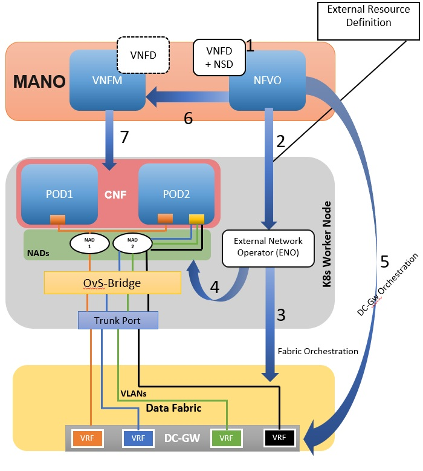
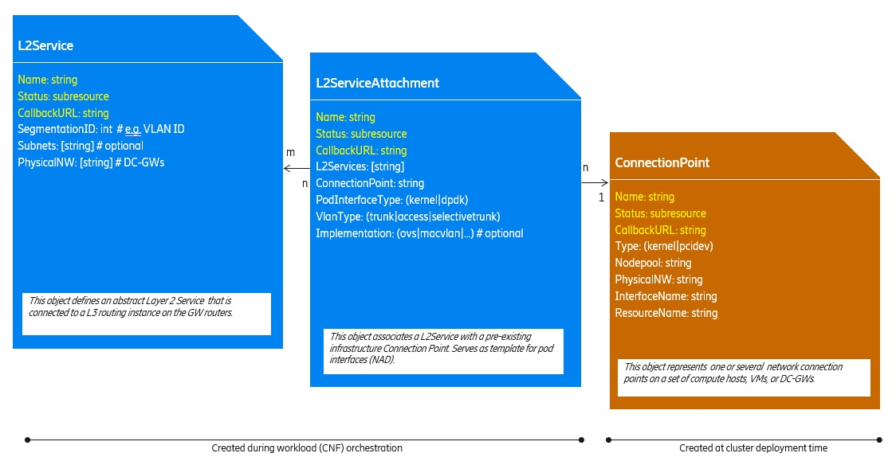
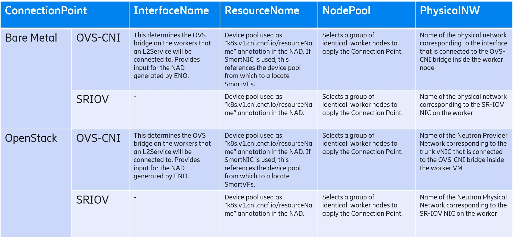
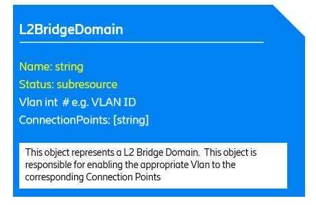
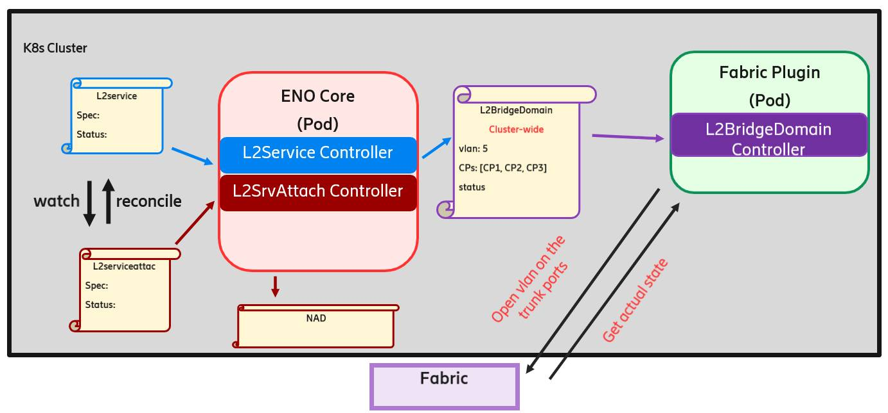
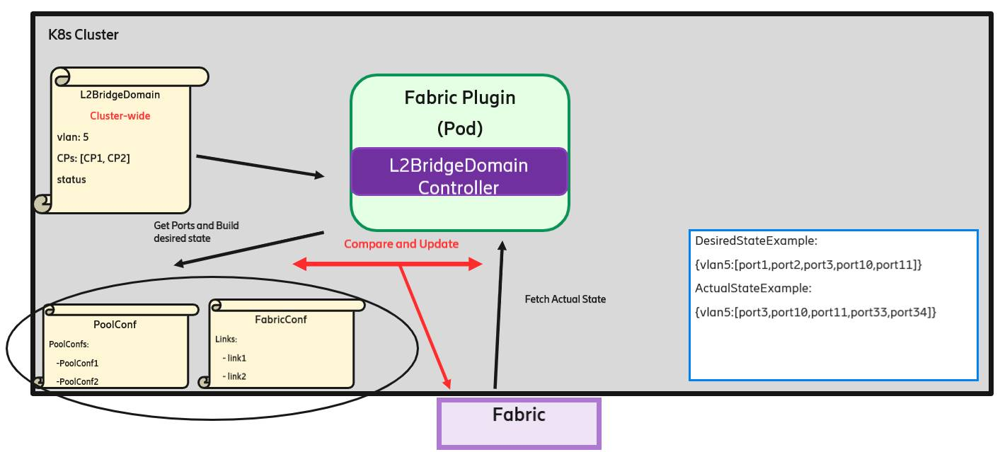

# ENO (External Network Operator)

## Current Situation

> Primary/Standard K8s networking model relies on single NAT’ed interface and stateful load balancer when interworking with external networks. As a result, does not allow proper network separation and its implementation through Linux kernel IP stack mechanisms does not fulfill the performance requirements of many TelCo VNFs.
>
> Secondary/Special network attachments were introducted to overcome these TelCo specific limitations:
>
> - Allows pods direct L2 attachment to multiple external networks for network separation.
> - Support of exotic TelCo specific protocols.
> - Different network attachment types (kernel interface, VirtIO device, SR-IOV VF device) to cover a wide spectrum of performance requirements, including those of high-throughput user plane CNFs.
>
> Network interfaces to pods are provided by Container Network Interface (CNI) plugins. [Multus](https://github.com/k8snetworkplumbingwg/multus-cni), as meta CNI is able to handle a pod requesting more than the mandatory primary interface and delegates the interfaces plumbing and configuration to the actual CNI plugins responsible for each pod interface.
>
> However, all this is achieved through static pre-provisioned external networks during the initial cluster deployment; which cannot be updated on demand in an automated manner. Resulting, K8s pods (CNFs) can only consume those preconfigured external networks. This limited support for external network orchestration makes the overall networking solutions static and CNFs bound to specific deployed K8s cluster.

## Expected behaviour

> It is expected that the external networks can be added/configured on demand during the lifetime of a K8s cluster. So, whenever a new K8s application pods (CNFs) have to be instantiated, a cloud admin can orchestrate the external networks so that, the cloud user can attach their application pods (CNFs) to provisioned external networks.
>
> In fact, [ENO](https://github.com/Nordix/eno) is an attempt at providing a network orchestration API on the K8s cluster for use by the cloud admin to automate the necessary configuration inside the cluster and on the DC fabric. ENO generates the artefacts (e.g. network attachment definition CRDs) that application pods can refer to connect to networks. A CNI is responsible for the plumbing of a given pod interface to an existing network at pod creation time based on the NAD and infrastructure established by ENO at network creation time. The authorization of a pod for connecting to a network depends if it is allowed to use the NAD (e.g. using namespaces). Below is an example workflow showcasing E2E K8s secondary network orchestration using OvS in BareMetal based deployment.

<figure class="image">

<figcaption>Figure 1: E2E K8s Secondary Network Orchestration using OvS in BareMetal based deployment</figcaption>
</figure>

> 1. On-board CSAR packages (like, VNFD, NSD) using NFVO.
> 2. NSD parsing and generation of ENO external resource definition (CRs)
> 3. Using southbound interface and APIs, ENO will configure VLANs based on external resource definition and assign them to trunk port.
> 4. After fabric automation, ENO will create net-attach-def (NADs) using OvS-Bridge.
> 5. DC-Gw orchestration either via NFVO or manually through scripts i.e. VRF creation and VLAN association within VRF at DC-Gw.
> 6. NFVO delegates to VNFM to deploy the CNF according to the VNFD + provided parameters
> 7. VNFM parse the VNFD and instantiate the CNF, which deploys PODs with created tenant network to facilitate the external networking.
>
> Note: There's an assumption with the current Data Model for ENO NBI (Northbound-interface) that, the DC Edge (DC-GW) orrchestration will be done by NFVO directly. It would require extension of the ENO NBI to cover DC Edge orchestration (like, with many other thing not yet evaluated: primary external networking/ECFE (MetalLB), NSM etc).
>
> There's an attempt to design data model for ENO northbound and southbound interface for configuring K8s node level and data fabric level external network configuration.

### ENO Northbound-interface (NBI) Data Model

> Basic API Concepts
>
> - The API for external networks in K8s consist of object data structures that clients (like, NFVO, scripts, or manually by cloud admin) create or delete through the REST API of the Kubernetes API server.
> - As shown below, each API object is represented as a blue/orange box which has equivalent representations in YAML or JSON format.
> - Each API object is represented by Custom Resource inside namespaces of the k8s cluster.
> - In order to interact with the external network API, a client can for example create an object representation in a file in YAML format and post it to the Kubernetes API server, equivalent to the shell command “kubectl create -f myobject.yaml”.
> - ENO watches for creation and deletion of API objects and takes appropriate action to fulfil the API request.
> - Results of API requests are represented in the status subresource of each API object.
>   - Clients can subscribe for API results and general state changes by providing a URL in the CallbackURL field. This is to free the client from the need to poll for changes.
>
> API Usage and Feedback
>
> - When the state of an object changes, and the object’s CallbackURL field contains a valid http or https URL, the state change will result in a REST call to that URL with the entire new state of the object as a parameter in JSON encoding.
>   - Upon successful creation, the status of an object will transition to “ready”.
> - To undo the effect of API object creation, e.g. to have network artifacts removed, API clients will delete the API objects they previously created. ENO will never delete API objects on its own initiative. Dependent API objects that become orphaned will not be deleted automatically.
> - When a client tries to delete an object, the ENO controller may  perform sanity checks to make sure the object is not in use, for example a L2Service and L2ServiceAttachment that still has pods attached.
>   - If the sanity check fails, ENO controller will mark the object with status=terminating and only delete it (without a further trigger from the client) once the objects that depend on it cease to exist.
>   - If the sanity check succeeds, the object and its depending artifacts will be deleted immediately. By depending artifacts we mean things like VLANs in the fabric and NADs.
>   - The delete notification will contain the last known object state and the status field will be set to “deleted”.
>

<figure class="image">

<figcaption>Figure 2: Secondary External Network Data Model</figcaption>
</figure>

> **Common Object Attributes**
>
> Following attributes are common to all API objects:
>
> - **Name:** name for this object; assigned by the API client. The name has to be unique among all objects of a given type within the same namespace.
>   - References between objects are based on object names.
> - **Status:** subresource maintained by the API implementation; read-only for the API client; containing at least:
>   - “phase”: string: one of (pending|ready|error|terminating|deleted); lifecycle phase of the object
>   - For BGPSessionGroup the status may be extended to also contain the worker BGP IP addresses
> - **CallbackURL:** assigned by the API client; this URL will be called by the API implementation when the state of the object changes
>
> **L2Service API Object**
>
> - **Purpose:** Defines an abstract Layer 2 service instance. It is typically connected to a L3 routing instance on the GW routers.
> - **Attributes:**
>   - *SegmentationID:* the unique integer identifier of the L2 network; VLAN ID if L2 network implemented as IEEE 802.1q
>   - *Subnets:* list of Subnet names associated with this L2 service instance
>   - *PhysicalNW:* physical networks where this L2Service shall be connected to DC-GWs. ENO enables the VLAN on the DC-GW facing fabric ports (CNIS) or on OpenStack trunk ports (NFVI).
>
> **L2ServiceAttachment API Object**
>
> - **Purpose:** Associates a L2Service with a pre-existing infrastructure Connection Point. ENO will create a NetworkAttachmentDefinition (NAD) based on this object. The created NAD will have the same name as the name attribute of the L2ServiceAttachment.
> - **Attributes:**
>   - *L2Services:* list of L2 service instances that this object attaches to a connection point
>   - *ConnectionPoint:* name of the connection that this attachment refers to
>   - *PodInterfaceType:* category interface inside a pod for this network attachment (kernel or dpdk)
>   - *VlanType:* VLAN interface category that this object allows pods to connect to; one of: (trunk|access|selectivetrunk). This attribute is needed particularly to distinguish trunks with a single VLAN from access ports. It is good practice to only put one L2ServiceAttachment of VlanType trunk on the same ConnectionPoint. If there are multiple trunk L2ServiceAttachments on the same ConnectionPoint, then all pods using any of the L2ServiceAttachments will have access to the union of all VLANs specified in all L2ServiceAttachments on the same ConnectionPoint.
>   - *Implementation:* CNI type suggested to implement pod networking on this interface ; one of: (ovs|macvlan....). Optional; the infrastructure will select it for the API client if not specified; in most cases there will be only one CNI implementation that satisfies the constraints (kernel/user space).
>
> **ConnectionPoint API Object**
>
> - **Purpose:** Represents  one or several  network connection points on a set of compute hosts or worker VMs. One ConnectionPoint object can reference multiple real connection points by referring to a number of equally equipped nodes with its NodePool attribute. ConnectionPoint objects are created at cluster creation time and only referenced by clients in other API objects.

<figure class="image">

<figcaption>Figure 3: ConnectionPoint Attributes (##TODO: Convert in markdown format)</figcaption>
</figure>

### ENO Southbound-interface (SBI) Data Model

> Basic API Concepts
>
> - The API for ENO SBI consists of a single Custom Resource Definition (CRD) for the creation of Layer 2 Bridge Domains across the Fabric.
> - The aforementioned CRD it is shown below, has a Kind of L2BridgeDomain and is a cluster wide resource (not namespace scoped).
> - The L2BridgeDomain Custom Resources (CRs) are only for internal use and are not meant to be created by any User or Cluster Admin.
> - The L2Service CRD that has been presented previously has one to one relationship with the L2BridgeDomain CRD.
> - The L2BridgeDomain CRs are getting created internally by the ENO core controller when L2Service CRs are getting created
> - The Fabric plugin controller will watch for the creation of L2BridgeDomain CRs and will take action to make the appropriate changes on the Fabric.
>
> API Usage and Feedback
>
> - When an L2Service CR is getting created the ENO core controller will watch for those events and will create the corresponding L2BridgeDomain CR.
>   - Until some L2ServiceAttachment CR consumes the created L2Service CR the L2BridgeDomain CR will include no Connection Points (CPs) and that means that no vlan will be opened on the fabric.
> - When a L2ServiceAttachment CR gets created the ENO core controller will watch for those kind of events and will update the L2BridgeDomain CRs with the appropriate CPs.
> - In continuation to that Fabric plugin controller will watch for the events around L2BridgeDomain CRs and will open the corresponding Vlans to the appropriate trunks on the Fabric.
>
> **L2BridgeDomain API Object**
>
> - **Purpose:** Represents a single L2 Bridge Domain. During the creation of such an object the corresponding Vlan will be opened to the corresponding switch ports on the fabric that are represented by the list of Connection Points in the L2BridgeDomain CRD.
> - **Attributes:**
>   - *Vlan:* the Vlan ID of the L2 network.
>   - *ConnectionPoints:* list of ConnectionPoints names which will be translated internally in a group of Fabric trunk ports where the corresponding Vlan should be opened.

<figure class="image">

<figcaption>Figure 4: L2BridgeDomain CRD</figcaption>
</figure>

#### ENO Components Overview

> Figure 5 depicts all the different components of ENO framework and how those components interact during the creation of a single L2ServiceAttachment CR.
>
> 1. Initially a L2ServiceAttachment object is getting created.
> 2. The L2ServiceAttachment controller will watch for those kind of events and will create the corresponding NAD and also will wait for the associated VLANs to be opened on the fabric.
> 3. In parallel the L2Service controller will also watch for the same L2ServiceAttachment events. When this happens the controller will issue L2BridgeDomain update events to open the corresponding VLANs on the associated Fabric ports.
> 4. The L2BridgeDomain controller will watch for the L2BridgeDomain update events and will open the corresponding VLANs on the appropriate fabric ports.
> 5. When the VLANs has been opened on the fabric ports then the creation of the L2ServiceAttachment object is considered successful and the status will change to a state equal to "Ready".

<figure class="image">

<figcaption>Figure 5: ENO Components Overview</figcaption>
</figure>

#### ENO Fabric Plugin

> The below image shows a detailed overview of the fabric plugin component. Each fabric plugin in ENO needs one or more configuration files where the NodePool information (interface names, connection points, etc) and the Fabric information (Node names, interface names and switch port IDs) will be described. Those configuration files are important because through them ENO fabric plugin generates the desired state and use that to compare with actual state of the fabric.
> In figure 6 we can see a basic operation of the fabric plugin.
>
> 1. When a L2BridgeDomain event arrives the L2BridgeDomain controller kicks in and starts processing the event.
> 2. The controller will generate a desired state with the help of poolConf and fabricConf files. That desired state in this case is a group of ports that the corresponding Vlan should be opened by the end of controller operation.
> 3. In continuation to that the L2BridgeDomain controller will also fetch the actual state from the fabric. That consists of a group of ports where the corresponding Vlan is already open on the fabric.
> 4. The L2BridgeDomain controller then compares the desired state with the actual state for that specific vlan and if those states differ then configures the fabric ports accordingly.

<figure class="image">

<figcaption>Figure 6: ENO Fabric Plugin</figcaption>
</figure>

> The current ENO implementation focuses on the L2 ("VLAN provider network") use case for connecting secondary pod interfaces to a DCGW. To begin with, that's the most common scenario to automate for sure. It doesn't exclude other external network scenarios. The ENO APIs should be extendable to cover those. Calico as primary CNI with MetalLB as load balancer for incoming external traffic would, for example be an L3 use case that has already been considered and would be included in second phase. Similarly, we have plans to evaluate [NSM](https://github.com/networkservicemesh/networkservicemesh) in subsequent releases to extend ENO APIs to cover use-cases that are been addressed via NSM.
>
> ENO aims at providing automation APIs for networking solutions underneath the K8s cloud platform. An L2 service across a DC fabric to the GW being one that we have addresses so far. There may be others to be added with subsequent releases.

## How to get started

### Deploy ENO in k8s Cluster

```bash
git clone https://github.com/Nordix/eno.git
cd eno
make docker-build
make deploy
```
